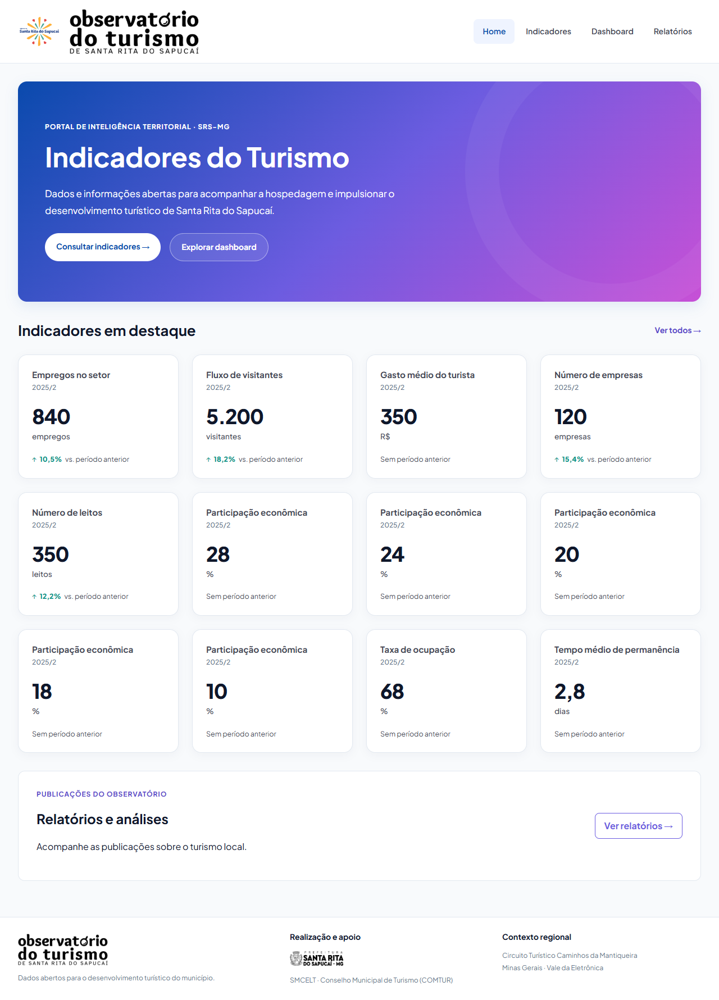
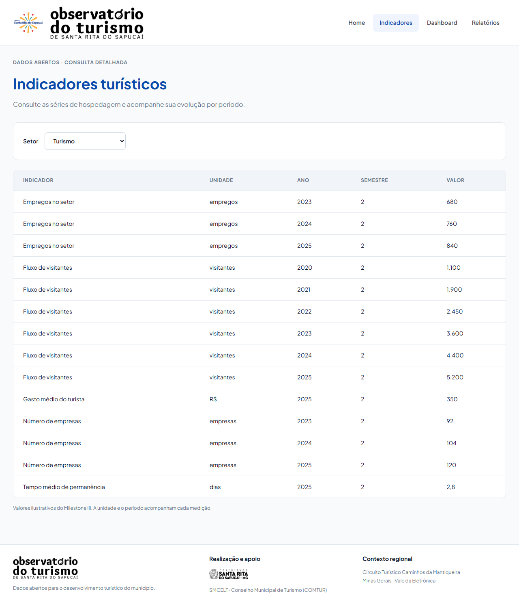
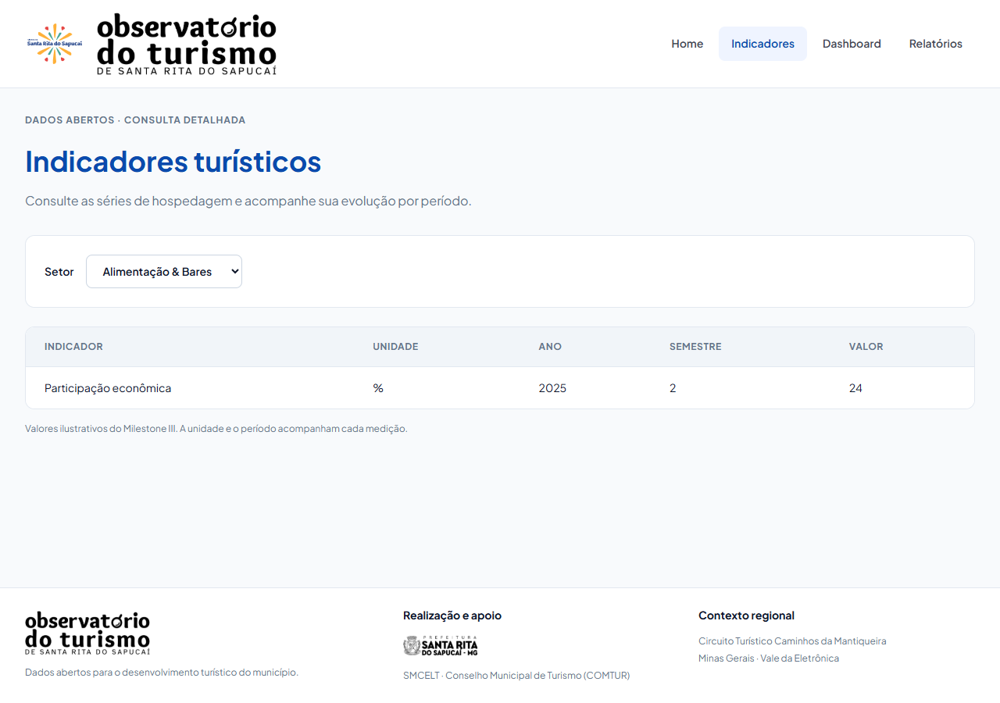
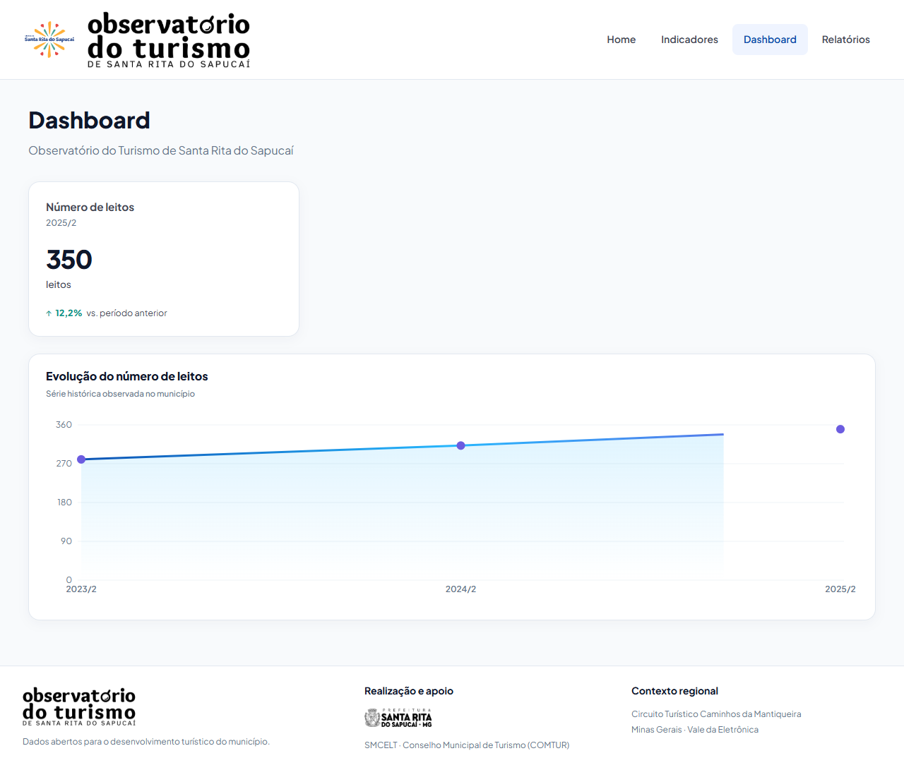
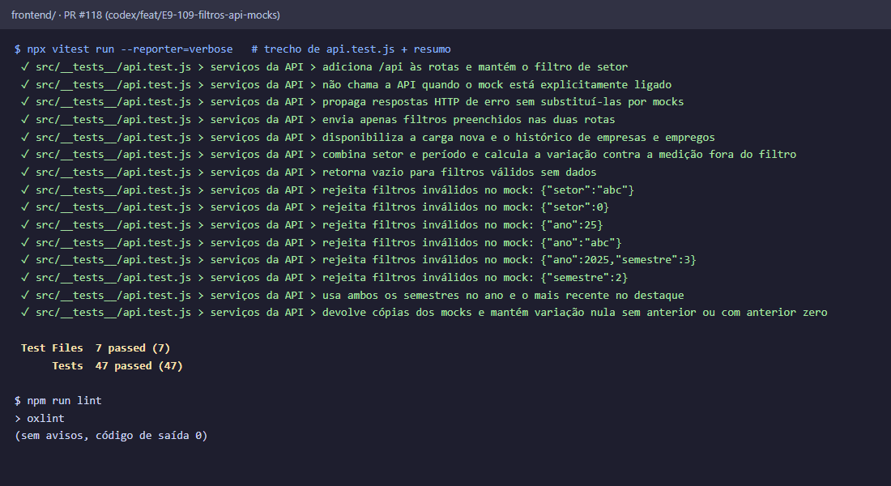

# Evidências do PR #118

Filtros opcionais em `services/api.js` e mocks com a carga nova (issue #109). Capturas com `npm run dev` e `VITE_USE_MOCK=true`, viewport de 1280 px de largura.

Home com os 12 destaques do mock. A variação usa a medição anterior: visitantes +18,2%, empresas +15,4%, empregos +10,5%, leitos +12,2%. Ficar só com os 4 destaques do mockup é a #112.

Indicadores com o setor Turismo: as 14 medições do mock, incluindo empresas e empregos de 2023/2 e 2024/2 (PR #117).

Indicadores ao abrir a página: o primeiro setor em ordem alfabética agora é Alimentação & Bares.

Dashboard sem mudança: card e série de leitos.

Testes de `api.test.js` (URL só com os filtros preenchidos, filtros combinados, variação fora do filtro, erros) e o lint:

