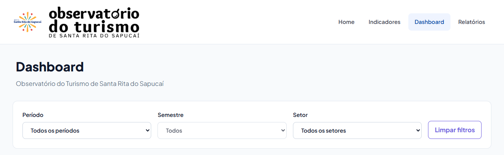
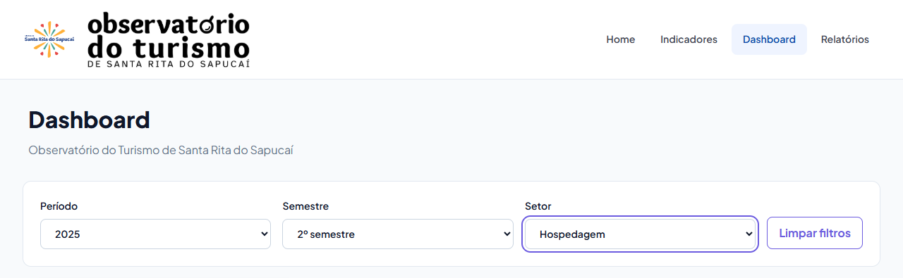
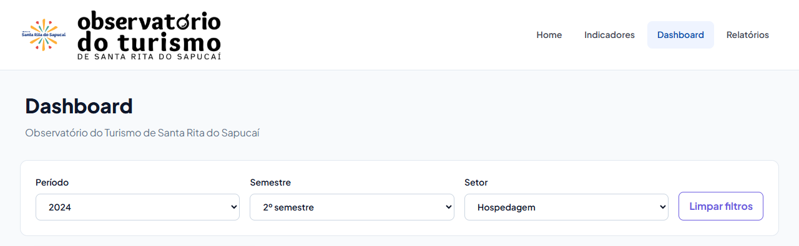
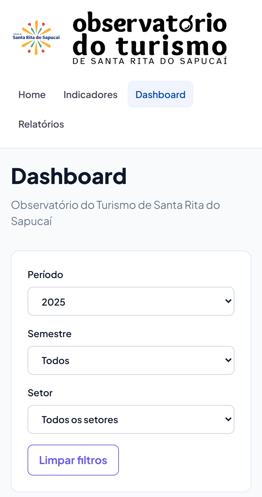
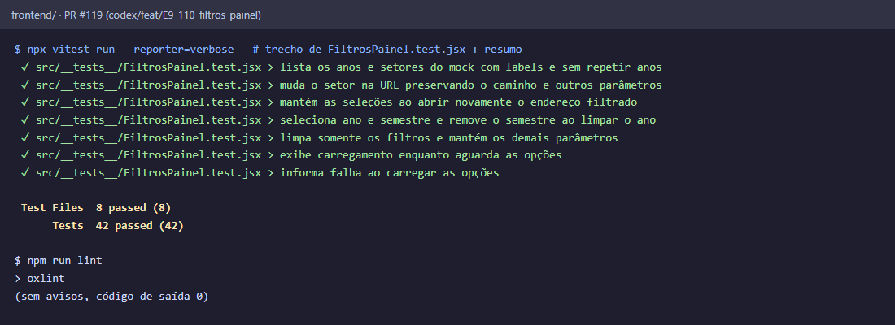
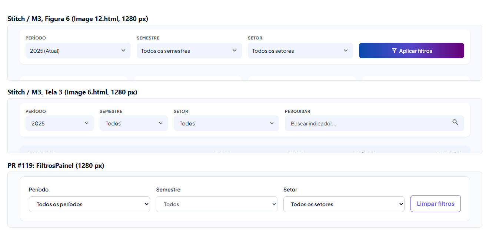

# Evidências do PR #119

Componente `FiltrosPainel` com o filtro na URL (issue #110). Capturas com `npm run dev` e `VITE_USE_MOCK=true`. Como a integração nas páginas é da #97 e da #111, o componente foi montado no topo do `/dashboard` só para a captura, numa alteração local que não faz parte do PR. Os cards abaixo dele ainda não reagem ao filtro. O mock desta branch tem só o setor Hospedagem e os anos 2023 a 2025.

Sem filtro (`/dashboard`): Semestre fica desabilitado até escolher um ano.

Só pelo teclado: Período com `End` (2025), `Tab`, Semestre com `End` (2º semestre), `Tab`, Setor com a seta para baixo (Hospedagem). A URL ficou `/dashboard?ano=2025&semestre=2&setor=1`.

Abrindo e recarregando `/dashboard?setor=1&ano=2024&semestre=2`, os três selects voltam preenchidos. "Limpar filtros" volta para `/dashboard`.

Celular, 390 × 844 (`/dashboard?ano=2025`): os filtros empilham e a página não rola na horizontal (largura do documento = 390 px).

Testes de `FiltrosPainel.test.jsx` e o lint:

Comparação com a barra de filtros dos mockups do Stitch (a mesma da Figura 6 do relatório do M3), todos a 1280 px:

