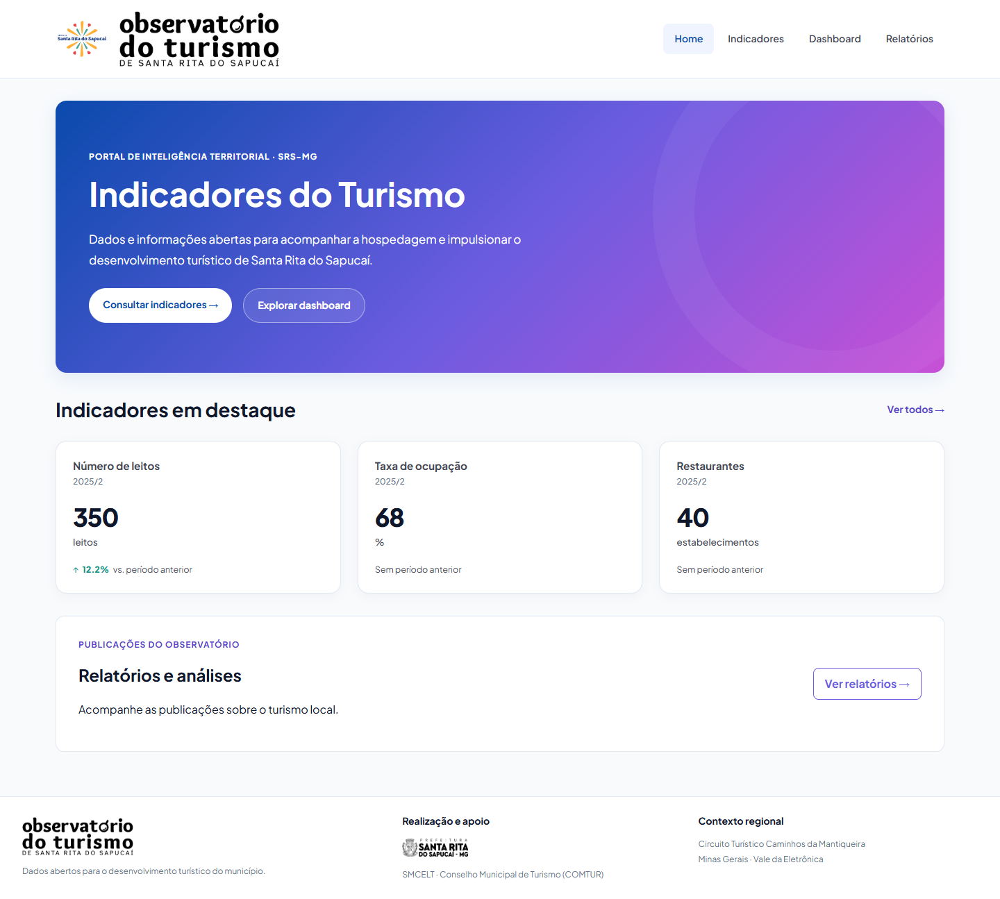
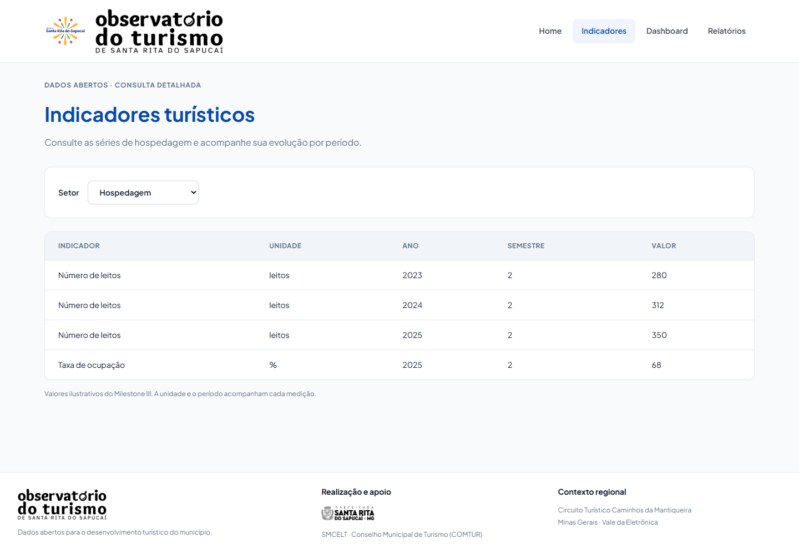
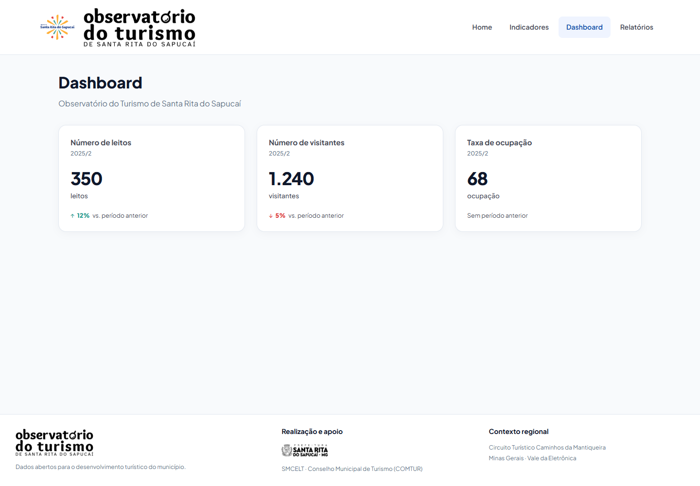
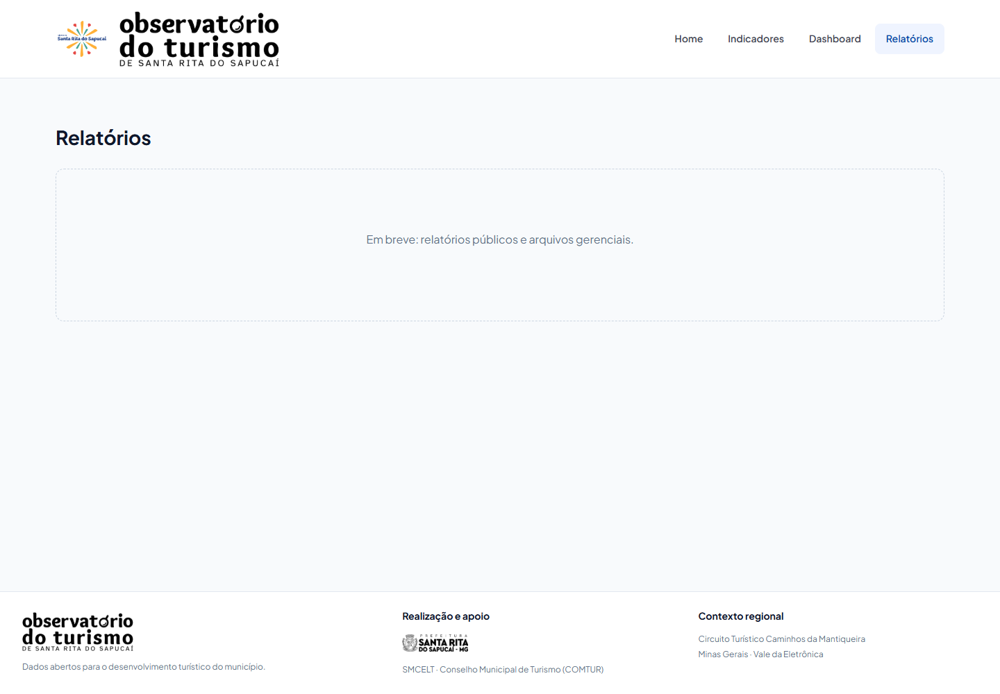

# Referências visuais do PR #48

Projeto consultado pelo MCP do Stitch: [Observatório do Turismo de Santa Rita](https://stitch.withgoogle.com/projects/10242954063342123145).

| Tela | Identificador no Stitch | Uso nesta entrega |
|---|---|---|
| Home | 9d981381c2f24f1a946b8d76509be510 | Hero com gradiente, chamadas para consulta, destaques e publicações |
| Indicadores | 79d21d51db2345819278ce03692cd5c8 | Cabeçalho da consulta, filtro e tabela em superfície clara |
| Dashboard | c15072d33cab477f9e07ab2f9a4622a9 | Referência visual; rota usa o Dashboard entregue no PR #54 |
| Relatórios | 3a2ad5c1ffb845198df3d05b7a3a6719 | Referência futura; página permanece “em breve”, conforme o escopo do M4 |

A implementação reutiliza o tema e o CardIndicador do PR #54. A Home adapta as propriedades do contrato da API às propriedades do card, incluindo o período ano/semestre. O M4 implementa os dados de hospedagem; as outras funcionalidades dos mockups ficam para entregas posteriores.

## Logos

- Marca de Santa Rita do Sapucaí: SVG Principal_Completo(PT) cópia.svg, disponibilizado no projeto Stitch (tela 7786936338819278063).
- Observatório, Prefeitura, SMCELT, COMTUR, Caminhos da Mantiqueira e Minas Gerais: imagens extraídas da página 7 de Proposta_Prefeitura_SRS_Inatel.pdf, fornecido pelo usuário.
- Os três níveis da proposta são preservados: marca do projeto, realização e apoio, contexto regional.
- Após a revisão da Karolina, o rodapé usa apenas os logos do Observatório (160 px) e da Prefeitura (95 px). SMCELT, COMTUR e as instituições regionais aparecem em texto, reduzindo o peso visual no celular. As duas marcas do cabeçalho são mantidas.

## Prints

Capturas da aplicação com VITE_USE_MOCK=true e os dados ilustrativos do M3. Os arquivos com sufixo -mobile usam viewport de 390 × 844; os demais usam 1440 × 1000. A tabela permite rolagem horizontal no celular.

