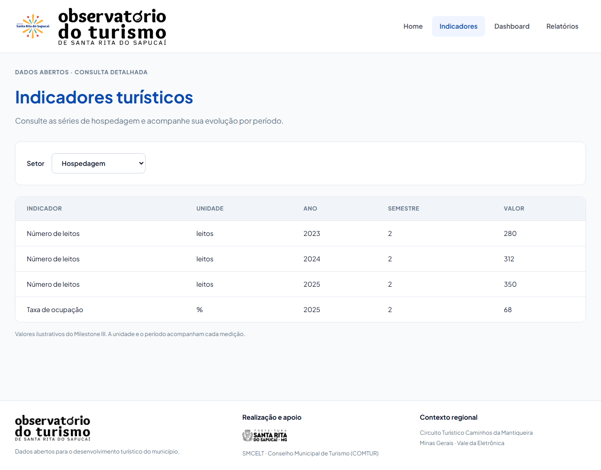
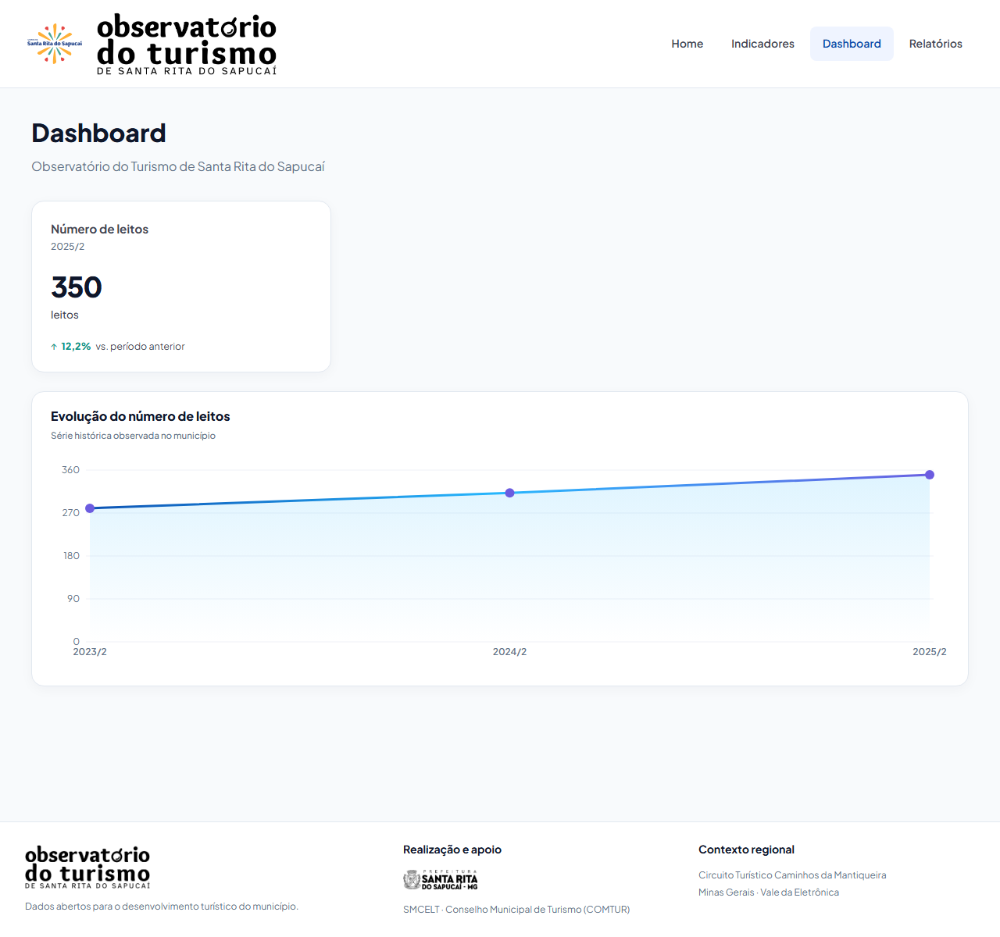
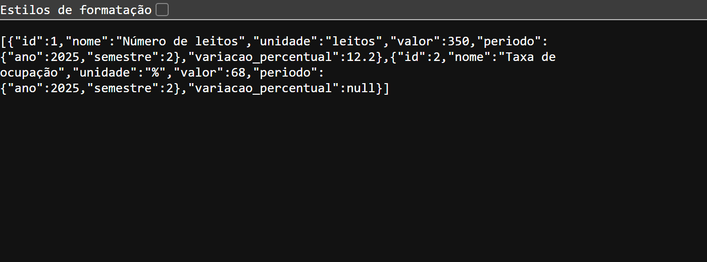

# Evidências do PR #65

Integração do front com a API real (issue #12). Capturas feitas com `docker compose up --build`: o front em `http://localhost:8080` consulta a API em `http://localhost:3000`, com `VITE_USE_MOCK=false` e os dados da carga de hospedagem (`backend/prisma/dados/hospedagem.json`). Viewport de 1280 px de largura.

Resposta de `GET /api/indicadores/destaques`, com os mesmos valores dos cards:

